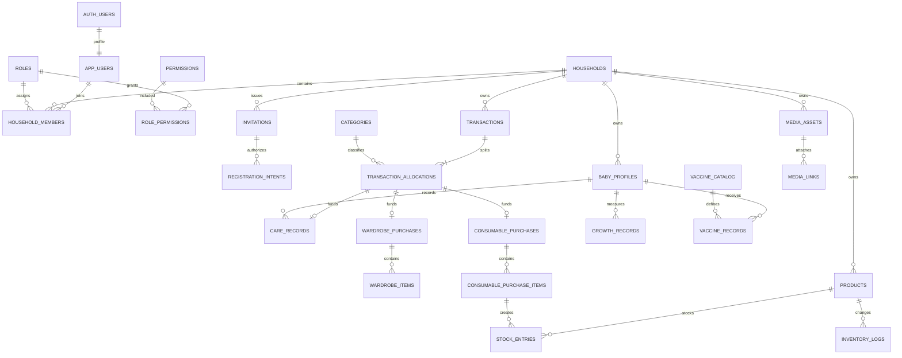

# 数据库 ERD

```mermaid
erDiagram
  AUTH_USERS ||--|| APP_USERS : profile
  APP_USERS ||--o{ HOUSEHOLD_MEMBERS : joins
  HOUSEHOLDS ||--o{ HOUSEHOLD_MEMBERS : contains
  ROLES ||--o{ HOUSEHOLD_MEMBERS : assigns
  ROLES ||--o{ ROLE_PERMISSIONS : grants
  PERMISSIONS ||--o{ ROLE_PERMISSIONS : included
  HOUSEHOLDS ||--o{ INVITATIONS : issues
  INVITATIONS ||--o{ REGISTRATION_INTENTS : authorizes
  HOUSEHOLDS ||--o{ TRANSACTIONS : owns
  TRANSACTIONS ||--|{ TRANSACTION_ALLOCATIONS : splits
  CATEGORIES ||--o{ TRANSACTION_ALLOCATIONS : classifies
  TRANSACTION_ALLOCATIONS ||--o| CARE_RECORDS : funds
  TRANSACTION_ALLOCATIONS ||--o| WARDROBE_PURCHASES : funds
  TRANSACTION_ALLOCATIONS ||--o| CONSUMABLE_PURCHASES : funds
  HOUSEHOLDS ||--o{ BABY_PROFILES : owns
  BABY_PROFILES ||--o{ GROWTH_RECORDS : measures
  BABY_PROFILES ||--o{ VACCINE_RECORDS : receives
  VACCINE_CATALOG ||--o{ VACCINE_RECORDS : defines
  BABY_PROFILES ||--o{ CARE_RECORDS : records
  WARDROBE_PURCHASES ||--o{ WARDROBE_ITEMS : contains
  HOUSEHOLDS ||--o{ PRODUCTS : owns
  PRODUCTS ||--o{ STOCK_ENTRIES : stocks
  PRODUCTS ||--o{ INVENTORY_LOGS : changes
  CONSUMABLE_PURCHASES ||--o{ CONSUMABLE_PURCHASE_ITEMS : contains
  CONSUMABLE_PURCHASE_ITEMS ||--o{ STOCK_ENTRIES : creates
  HOUSEHOLDS ||--o{ MEDIA_ASSETS : owns
  MEDIA_ASSETS ||--o{ MEDIA_LINKS : attaches
```

`STOCK_ENTRIES` 在物理数据库中继续使用旧表名 `inventory_batches`。这是有意的兼容层，不代表新界面继续暴露“批次管理”。
